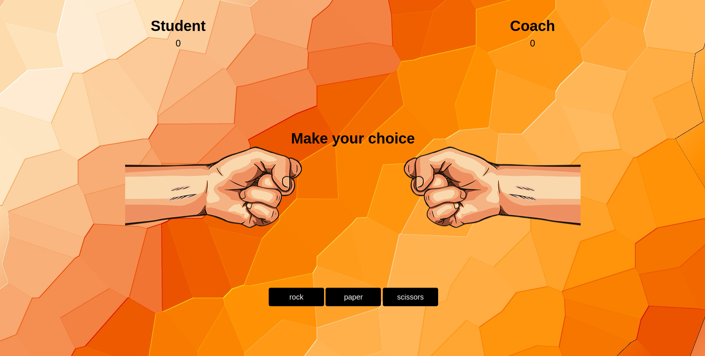

# Tech Interview Challenge: Rock/Paper/Scissors [](https://app.netlify.com/sites/kfrostare-rpscraftacademy/deploys)
This game was part of a tech Interview for [Craft Academy](https://www.craftacademy.se/english/). It was built in vanilla Javascript by [Karolina Frostare](https://github.com/kfrostare) with game layout/structure from [developer Edwin](https://github.com/developedbyed). More on that in acknowledgements at the bottom of this ReadMe file.



### You want one?
No problem! Fork [this repo](https://github.com/kfrostare/RockPaperScissors_CraftAcademy), clone it to your machine and give it your own touch and feel, then deploy on your choice of online deployment host.

Make sure you have Yarn installed on your machine. Other wise do:
```
yarn init
```
..to initialize yarn.

### Testing
This project was tested with Cypress, [check here](https://docs.cypress.io/guides/getting-started/installing-cypress.html#System-requirements) how to download. To be able to watch the tests go green on your machine (hey that rhymes) do:

```
yarn start
```
to run your server, and then do
```
yarn run cy:open
```
This project comes with three tests already made, that you can modify to your liking.

### Deployment

Add additional notes about how to deploy this on a live system

### This game was built using
* Javascript, html and css for style and logic. Yarn and Superstatic as dependency. Tested using Cypress.

## Acknowledgments

* For info on testing for images [Cypress](https://stackoverflow.com/questions/51246606/test-loading-of-image-in-cypress)
* For info on section tags from [GeeksforGeeks](https://www.geeksforgeeks.org/html-section-tag/)
* For hand- illustration art from [HiClipart](https://www.hiclipart.com/)
* For amazing, royalty free, high-rez background images from [Pixabay](https://pixabay.com/)
* For info on Viewport Height in Css from [Sitepoint](https://www.sitepoint.com/css-viewport-units-quick-start/)
* For amazing game structure and layout from [Dev Ed](https://www.youtube.com/channel/UClb90NQQcskPUGDIXsQEz5Q)
* For inspiration on how to build this game from [freeCodeCamp.org](https://www.youtube.com/watch?v=jaVNP3nIAv0)
* For inspiration on how to build this game from [Dylan Israel](https://www.youtube.com/watch?v=liMNNZuWZwY)
* For info on document.querySelector from [developer.mozilla.org](https://developer.mozilla.org/en-US/docs/Web/API/Document/querySelector)
<br><br>
* For info on deploying to Heroku from [SolidCode](https://www.youtube.com/watch?v=gX8HCul9cFg)
* For info on deploying to Glitch from [TheCodingTrain](https://www.youtube.com/watch?v=Rz886HkV1j4)
* For info on procfiles from [Heroku](https://devcenter.heroku.com/articles/procfile)
* For info on deploying from [Heroku](https://devcenter.heroku.com/articles/preparing-a-codebase-for-heroku-deployment#3-add-a-procfile )

## License
This project is licensed under the MIT License.